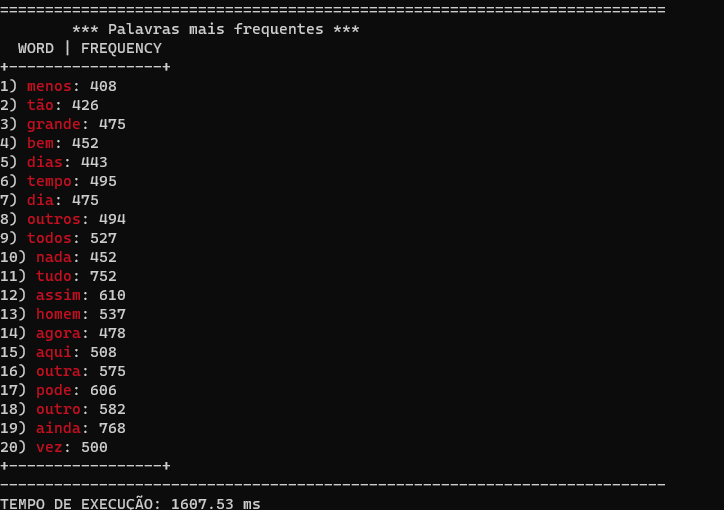

<h1 align="center" font-size="200em"><b> Top K Itens </b></h1>

<div align = "center" >
<!-- imagem -->

[](https://code.visualstudio.com/docs/?dv=linux64_deb)


</div>

## 📌Sumário
- [Introdução](#Introdução)
- [Objetivos](#Objetivos)
- [Arquivos](#Arquivos)
- [Resolução do Problema](#Resolução-do-problema)
- [Funções](#Funções)
- [Resultados](#Resultados)
- [Conclusão](#Conclusão)
- [Referências](#Referências)
- [Compilação e execução](#Compilação-e-execução)
- [Contato](#Contato)

## ✒️Introdução
<p align="justify">
Este é um programa desenvolvido em C++ para a disciplina de Algoritmos e Estruturas de Dados II. <br>
Neste problema, é preciso encontrar os `K` itens mais frequentes de uma coleção de dados. Logo, utiliza-se o hash para contar a frequência de todos os itens, enquanto o heap se aplica na manutenção de uma lista dos K itens de maior valor.
</p>

## 💻Objetivos

O objetivo desta atividade consiste em criar uma tabela de dispersão (hash) para contar a frequência de cada elemento tokenizado
da coleção de dados de entrada, logo apos criar uma árvore de prioridades (heap) de tamanho `K` e inserir os primeiros `K` elementos do
hash nela. Ao final ao fazer a combinação do uso de hash e da heap para manter a lista dos `K` elementos com maiores valores presentes nos textos. Para alcançar esse objetivo, é fundamental realizar um cuidadoso projeto das estruturas de dados e dos algoritmos correspondentes, com o intuito de garantir o resultado esperado.

<strong><h4>Condições impostas: </h4></strong>
- A quantidade de textos a serem processados deve ser colocado na variável `ARQ`, presente na `main.cpp` linha XX.
- O código realiza a leitura de arquivos ja existentes na pasta `data`, que devem ser intitulados como `input1`, `input2`..., ate a quantidade de arquivos desejada.
- As K palavras mais frequentes que deseja saber deve ser informado tambem, na varivel `K` presente no arquivo `main.cpp` linha XX.
- Existe um arquivo de ```stop words``` para análise. Sendo as stop words artigos e conjunções que podem ser alteradas de acordo com a preferência do usuário.
- A saída vai fornecer os dados após a análise do arquivo de entrada.
 
## 📄Arquivos
- <strong>Main.cpp:</strong> Leitura dos arquivos ```input1.txt```, ```stopwords.txt```,  tempo de execução do código e é realizada a chamada das funções necessários para o funcionamento.
- <strong>header.cpp:</strong> Inclusão das bibliotecas e arquivos utilizados.
- <strong>functions.hpp:</strong> Declaração das funções.
- <strong>functions.cpp:</strong> Desenvolvimento das funções. 
- <strong>data/input.txt:</strong> Texto de entrada.
- <strong>data/stopwords.txt:</strong> Stop words, como por exemplo, para artigo (a, o, as,os) e para conjunções (e, ou).


## 🔨Resolução do problema
Foi pensado em qual maneira poderia ser realizado a leitura dos texto de forma eficiente e rapida, com isso foi achado uma expressão regular nominada Regex. 
Entao inicialmente é feito a abertura do arquivo `stopwords.txt` e armazenado todas as palavras em uma hash para ser usado mais a frente, logo apos é feito a abertura do texto a ser analisado, com isso é lido linha a linha e sendo processado pelo regex para obter somente as expressoes regulares, a cada hora que encontrasse algo não estivesse contido no regex era significado que de havia encontrado uma palavra e entao poderia colocar na hash, esse processamento é feito em todos os textos e fazendo a comparação tambem se a palavra encontrada nao é uma StopWord, pois se for nao ira ser adicioando a hash, pois devemos desconsiderar as palavras contidas no arquivo de StopWords. 
Logo apos todos os textos terem sido lidos e as palavras terem sido devidamente contabilizadas e adicionadas a hash é colocada as `K`, quantidade desejada pelo usuario, primeiras palavras da hash em um vetor e realizado a comparação com cada item restante da hash para obter somente as `K` mais frequentes na hash.


## Estruturas utlizadas
<h2>Regex</h2>
As expressoes regulares vem exatamente com o intuito de serem usadas em textos para manipular e encontrar padroes, são muito utlizadas para achar palavras reservadas e tokens especificos, sendo isso exataemente oque é preciso para a realização dessa atividade.
Na definição de uma regex podemos utilizar dois tipos de caracteres: os literais, usados normalmente em strings, e os metacaracteres, que fazem com que a regex possa processar e manipular informações e trabalha  tambem com agrupamento entre varios outros, os utilizados nessa atividade foi o metacaractere: `+`, para considerar mais de um carctere ate que chegue em algum que não é uma expressão regular, e tambem o agrupamento para considerar palavras minusculas, maiusculas e numeros.
O Regex foi usado no contexto no qual iria processar somente as palavras que eram consideradas expressoes regulares, isso é todas as palvras do texto em exceto os caracteres de pontuação.<br>

O regex utilizado para essa atividade é: `("[a-zA-Z0-9'À-ÿ\\-“”]+")`, ele ira englobar as letras de `a` à `z` em minúsculo e o `A` à `Z` em maiusculo, os numeros de 0 à 9 e as palavras que forem acentuadas tambem, e somente alguns caractres especiais que é feito o tratamento durante o programa, como `“”` e tambem o `-`, o `+` como explicado acima é para continuar considerando as outras além da primeira que encontrar no Regex. <br>

A complpexidade do Regex é de O(n) pois eles sao compilados por meio de DFA (Deterministic Finite Automata) que ao ser compilada em uma string tem custo constante.
<br>

<h2>Unordered_map</h2>
<!-- é um contêiner associativo que contém pares de chave-valor com chaves exclusivas. Possuem as funções de pesquisa, inserção e remoção de elementos têm complexidade de tempo constante média. Eles nao sao ordenados em uma ordem especifica, os containers armazenam os elementos formados pela combinação de um valor de chave e um valor mapeado.
Unordered_map internamente é implementado usando Hash Table , a chave fornecida para mapear é hash em índices de uma tabela hash, razão pela qual o desempenho da estrutura de dados depende muito da função hash, mas, em média, o custo de pesquisa, inserção e exclusão de a tabela de hash é O(1). Sendo no pior caso a complexidade indo de O(1) a O(n). -->

Um unordered_map é um tipo de contêiner associativo que armazena pares de chave-valor, onde as chaves são exclusivas. Ele oferece operações de pesquisa, inserção e remoção de elementos com um tempo médio constante. A ordem dos elementos não segue uma sequência específica. Esses contêineres armazenam itens resultantes da combinação de valores de chave e valores mapeados.

Internamente, o unordered_map é implementado utilizando uma Tabela de Hash. A chave fornecida para a associação é transformada em índices na tabela hash por meio de uma função de hash. Por essa razão, o desempenho dessa estrutura de dados depende da eficiência da função de hash. Em média, os custos de busca, inserção e exclusão na tabela de hash são de ordem O(1). No pior caso, a complexidade varia de O(1) a O(n).

 Os elementos de um contêiner associativo não ordenado são organizados em baldes. Chaves com o mesmo código hash aparecem no mesmo bucket com outras palavras para os casos que ocorrem colisões, internamente o unordered_map trata de maneira que usa o encademaneto de colisões ou seja ele inclui a criação de buckets que ira conter os dados.

<h2>Heap e Heapify</h2>
Um heap é uma estrutura de dados que mantém uma coleção de elementos com uma propriedade especial de prioridade.Essa propriedade garante que em um heap máximo (onde o elemento de maior prioridade está no topo), cada nó pai tem um valor maior ou igual aos seus filhos(2n+1 e 2n+2). No caso de um heap mínimo (onde o elemento de menor prioridade está no topo), cada nó pai tem um valor menor ou igual aos seus filhos. Essa propriedade garante que o elemento de maior (ou menor) prioridade possa ser acessado e removido eficientemente, a propriedade de heap é que define a ordem dos elementos em relação aos seus pais e filhos e se aplica ao nó raiz, então no caso de um heap minimo, o elemento na posição zero do vetor é oque sera frequentemente comparado.
Heapify é um processo fundamental na construção e manutenção de um heap. É uma operação que corrige a ordem dos elementos em um subárvore para garantir a propriedade de heap. Geralmente, ela é usada após a inserção de um novo elemento ou após a remoção do elemento de maior (ou menor) prioridade. O objetivo do heapify é reorganizar os elementos de forma que a propriedade de heap seja mantida.
A priority_queue é uma implementação de heap fornecida pela biblioteca padrão do C++, que facilita a criação e o uso de heaps para armazenar elementos com base em suas prioridades.


Um heap binário é uma estrutura de dados que mantém uma coleção de elementos com uma propriedade especial de prioridade.Essa propriedade garante que o elemento com a maior (ou menor) prioridade possa ser rapidamente acessado e removido. Sua implementação é feita seguindo a logica de que cada nó tera seus filhos sendo maiores que o mesmo, dessa maneira o nó de posicção zero na compração a ser feita é um elemento menor que a primeira posição do vetor. Uma boa estutura que realiza a implementação de heap é a priority_queue. 

## 🔨 Funções
- <strong>readText:</strong> Processamento dos textos baseados nas expressoes regulares.
- <strong>treatments:</strong> É uma função para o tratamento de caracteres que deveriam ser desconsiderados nos texto.
- <strong>fillHeap:</strong> É a função que ira adicionar as K primeiras da hash em um vetor e feita a comparação com o restante da hash, o processo de adicionar na hash e fazer a comparação é feita com o heapify do heap_sort, logo depois de comparado com todos os elementos da hash é chamado uma função de ordenação para o vetor, o QuickSort ja que é um dos melhores algoritmos de ordenação e com uma boa complexidade.


## 🎯Resultados
É mostrado ao usuario em formato de tabela as K palavras mais frequentes na cor vermelha e suas respectivas frequencias. 
É possivel observar quais são os pais e os filhos, os filhos são: 2i + 1 e 2i+2, sendo o 'i' o numero do indice. Por exemplo, no indice 1 da imagem ao realizar as contas da os valores de numero 3 e 4 e podemos ver que esses indices são números maiores que o de indice 1 e com isso podemos ver que o funcionamento do Heap esta correto.
<p>

</p>


## ✔️Conclusão
A partir dessa atividade foi possivel aprender novas maneiras de otimização na leitura de textos e mlehoras nessas praticas, foi possivel aprimorar os conehcimentos na tokenização e aprender tmabem novas estruturas para serem utlizdas como o Regex. Uma boa atividade que agrgou meus conheciemntos

## ✔️Referências
- https://www.geeksforgeeks.org/regex-regular-expression-in-c/
- https://pt.wikipedia.org/wiki/Express%C3%A3o_regular
- https://www.alura.com.br/artigos/regex-c-sharp-utilizar-expressoes-regulares#:~:text=em%20um%20CPF.-,Ok%2C%20mas%20como%20funcionam%20as%20regex%3F,acordo%20com%20a%20leitura%20ocidental).
- https://www.geeksforgeeks.org/unordered_map-in-cpp-stl/
- https://stackoverflow.com/questions/21518704/how-does-c-stl-unordered-map-resolve-collisions


## 👾Compilação e execução

O codigo disponibilizado foi criado e executado em notebook Acer core i5 Aspire M com sistema operacional Windowns 10 e utlizado um terminal de comando com WSL.

O codigo possui um arquivo Makefile que realiza todo o procedimento de compilação e execução. Para tanto, temos as seguintes diretrizes de execução:


| Comando                |  Função                                                                                           |                     
| -----------------------| ------------------------------------------------------------------------------------------------- |
|  `make clean`          | Apaga a última compilação realizada contida na pasta build                                        |
|  `make`                | Executa a compilação do programa utilizando o g++, e o resultado vai para a pasta build           |
|  `make run`            | Executa o programa da pasta build após a realização da compilação                                 |


## ✉️Contato
<div>
 <br><p align="justify"> Jullia Fernandes Felizardo</p>
 <a href="https://t.me/JulliaFernandes">
  
 </div>
<a style="color:black" href="mailto:julliacefet@gmail.com?subject=[GitHub]%20Source%20Dynamic%20Lists">
✉️ <i>julliacefet@gmail.com</i>
</a>
